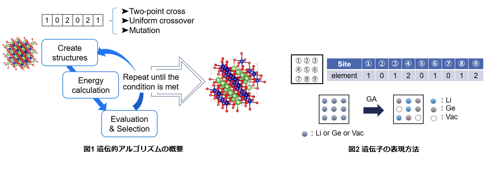

# Genetic Algolithm for mAterial (GmAte.py)

無機構造の安定配列を探索するプログラム

作成：横山弓夏（名工大・中山研）

※現在は日本語の説明のみ掲載しています。

## 概要  
遺伝的アルゴリズムを用いて、指定したサイトのイオン配列を系のエネルギー値が低くなるように最適化するプログラムです。他元素置換した際の最安定構造を探索する場合等に用いることができます。
  
  
## 詳細説明  
他元素置換した無機構造を評価する際、どのサイトの原子を置換するかが重要となってくる。多くの場合、最安定な構造を使用することになるが、その配列の組み合わせは10の何乗にも及びすべての場合を計算して求めるのは計算コストを考えると不可能に近い。本スクリプトでは、最適解を求めるアルゴリズムである遺伝的アルゴリズム（GA）を用いることで、より少ない探索回数で最安定構造を発見することができる。  

図1に遺伝的アルゴリズムの流れを示す。遺伝的アルゴリズムでは遺伝子を用いて最適化を進めていくわけだが、イオン配列の最適化を行うため図2に示すようにサイトに番号を振り、サイトに入る原子を数字で表すことで遺伝子を表現している。    

はじめに、ランダムに配置した構造をいくつか作成し、エネルギー値を評価する。その中でエネルギーの低い優秀な個体を生存種として選択し、それらの構造を以下の4つの過程によって次世代に引き継ぐ。  
1) エネルギーの安定性が上位の構造をそのまま引き継ぐ  
2) 2点交叉により遺伝子を作成  
3) 一様交叉により遺伝子を作成  
4) 突然変異により遺伝子を作成  

## 使用方法
**◆計算準備◆**
1. 以下のファイル構造を作成する  
    * Specific  
        ├POSCAR_org  
        ├inp_POSCAR.py  
        ├optm3g.py (thread=True, runtype="m3g"のときに必要。M3Gnetによる計算、importが一回で済む。)  
        └calc_energy.py (thread=Falseの場合に必要、遺伝子からPOSCARを作成する場合にも使用可能)   
    * inp_ga.py  
    * inp.params  
    * prepstrings.py 
    

2. POSCAR_orgの作成  
    通常のPOSCARを作成し、配列を最適化したいサイトのラベルをELEM1に変更する。
    ただし、最適化したいサイトが2つ以上ある場合は、ELEM2, ELEM3,...とラベリングを行う。

3. inp_POSCAR.pyを編集  
    

    Table1. inp_POSCAR.pyのパラメータ 
    
  
    
    | parametar | example | memo |
    |----|----|----| 
    | runtype | "m3g" | staticの場合は"m3g-static"。プログラム内でruntypeに対応した計算コードを定義しています。|
    | ions | ["Li", "Al", "O"] | すべての原子 |
    | ELEM | [["Li", "Al"]] | 配列を最適化する原子[[ELEM1のイオン], [ELEM2のイオン], ...]  |
    | savefiles |  ["POSCAR", "CONTCAR", "temp_gene"] | 保存するファイルの指定 |
    | output | "energy" | 計算により吐き出されるenergyファイルの指定。このファイルを読み取ってエネルギー値を取得しています。| 
    | thread | True | 外部ファイルをimportして緩和計算する場合はTrueにしてください。Falseの場合、毎計算calc_energy.pyを起動します。 |  
    
    thread = Trueにすることで、構造緩和の際のpythonのimport回数が1回で済むことにより計算時間の短縮が見込めます。
   例）thread = True, runtype = m3g の場合：Specific中のoptm3g.pyを読み込んでM3GNetによる構造緩和が行われます。
       thread = False の場合は、M3Gnetを実行するpythonファイルが必要です。この場合、計算のたびにモジュールがimportされることになります。

5. inp_ga.pyを編集  
    遺伝的アルゴリズムの条件を設定する  
    

    Table2. inp_ga.pyのパラメータ   
    
  
    
    | parametar | default | memo |
    |----|----|----| 
    | POPULATION | 24 | 1世代あたりの個体数 |
    | NUM_OF_STRINGS | 1 | 最適化する遺伝子の数 |
    | MAX_GENERATION | 300 | 最大世代数 |
    | SAVE | 3 | 次世代に引きつぐ最優秀な個体の数 |
    | SURIVAL_RATE | 0.6 | 次世代に親として引き継ぐ個体数 |
    | CR_2PT_RATE | 0.4 | 2点交叉の割合|
    | CR_UNI_RATE | 0.4 | 一様交叉の割合 |
    | CR_UNI_PB | 0.5 | 一様交叉が発生する確率 |
    | MUTATION_PB | 0.02 | 突然変異が発生する確率 |
    | STOP_CRITERIA | 100 | 停止条件 |
    | RESTART | True | 計算を続きから投げ直す場合はTrueにしてください。ただし、out.value_indivファイルが必要です。　初めから始める場合はFalseにしてください。 |
    | ELEMENT_FIX | True | 各要素数を固定したい場合はTrueにしてください。 |
    | temp_gene | "temp_gene" | |
    | eval_file | "energy" | エネルギー値を読み取るファイル名 |
    | ncore | 1 | 並列して行う緩和計算の数 |
  
  
6. inp.paramsを作成  
    初期遺伝子を作成するファイル。どの元素が何個あるかを読み込むのに使用する。  
    1) prepstrnigs.pyを編集  
        0, 1, 2...遺伝子番号はinp_POSCAR.py内のELEMで設定した順番と対応  
    2) prepstrings.pyを実行  
        inp.parmasが作成される  

**◆計算の投げ方◆**  
* GmAte.py -ga  
    配列の最適化がスタートする。  
&nbsp;  
* GmAte.py -bestgene out.value_indiv 1 5  
    上位1位から5位を抽出しそれぞれディレクトリを作成する。
&nbsp;  
* calc_energy.py -gene2pos
    temp_gene, POSCA_orgがあるディレクトリで実行すると、temp_geneの中にある遺伝子を読み取ってPOSCARを作成する。
    Save_infoやout.value_indivに遺伝子配列は保存されています。 
  
&nbsp;      
## 生存個体選択方法について
GmAte.py 26行目付近において生存個体の選択方法を指定することができます。   
select_mode = "ranking"  

* ランキング選択(ranking)  
    gstringと同様の選択方法。エネルギーの安定順に並べ、上位を生存個体とする。
* トーナメント選択(tournament)  
    トーナメント戦を行い、勝者を生存個体とする。
* ルーレット選択(roulett)  
    優秀順に重みを付けルーレットを回すことで生存個体を選択する。優秀な個体ほどルーレットで選ばれやすくなるように重みがつけられている。  
      
&nbsp;      
## Exampleについて    
* LSCF_M3GNet  
    La38Sr26Co13Fe51O192の(La, Sr)サイト、(Co, Fe)サイトについて最適化を行ったもの  
    calc_energy.pyでm3g.pyを起動させることで、M3GNetによる計算を行っています。
    ※現在、m3g.pyはGithubに載せていません。  
    La, Sr, Co, Feの数は固定しています。  
&nbsp;      
* LSCF_nofix_M3GNet  
    (La, Sr)64(Co, Fe)64O192の(La, Sr)サイト、(Co, Fe)サイトについて最適化を行ったもの  
    m3gnetを使用して計算を行っています。
    (La, Sr), (Co, Fe)の比率は固定していません。  
&nbsp;
* LiAlO2_import_M3GNet
    LiAlO2のカチオンサイトの最適化を行ったもの
    Specific/optm3g.pyを用いてM3GNetによる計算を行っています。
    importが一度で済むため計算速くなります。  

      
    

## ライセンス、引用について (License, Citing)
**ライセンス(About License)**　This software is released under the MIT License, see the LICENSE.  
**引用先(Citing)**  
・M3gNet https://github.com/materialsvirtuallab/m3gnet
    

    

